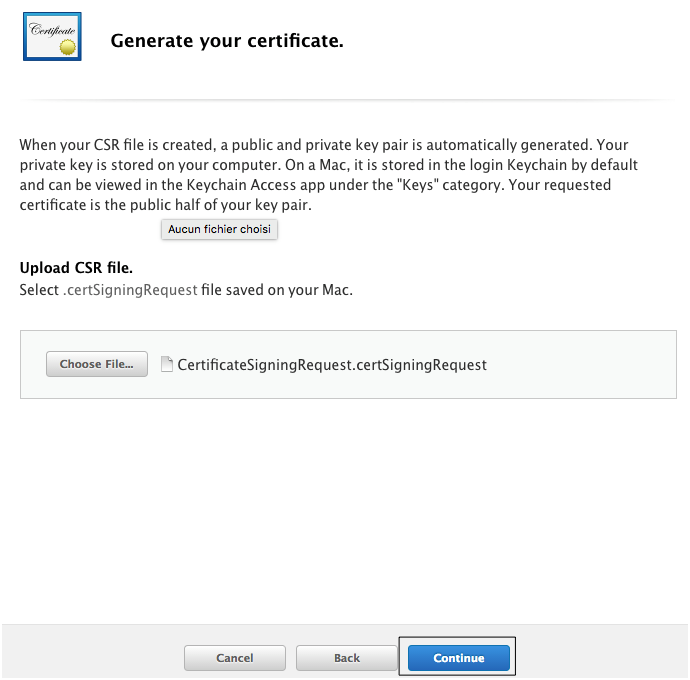

# TUTO NOTIFICATION

Se connecter à https://developer.apple.com/account/ios/certificate avec ses identifiants Apple et acceder à cette page. Trouver dans la liste le bundle identifier que l'on veut modifier.  Cliquer dessus pour faire dérouler les informations, puis cliquer sur le bouton `Edit`.

Activer les notifications push.

Maintenant aller dans le gestionnaire de `Trousseaux d'accès`.

Dans le menu de la fenètre aller dans `Trousseaux d'accès -> Assistant de certification -> Demander un certificat à une autorité de certificat...`.

Renseigner ses données, surtout cocher la case `Enregistrée sur disque`. Enregistrer le fichier.

Retour sur le site Apple Developer, cliquer sur `Create Certificate` dans la section `Production SSL Certificate` pour avoir un certificat de production.

Suiver les instructions.

Choisir le certificat crée précédement avec l'aide du `Trousseaux d'accès`.

Cliquer sur `Continue`.

Télécharger le certificat en cliquant sur `Download`.

Aller dans le `Finder` à l'endroit du téléchargement du fichier et double cliquer sur le fichier téléchargé.

La fenetre du `Trousseaux d'accès` devrait s'ouvrir avec votre certificat `Push Services`.

Dérouler le afin de voir la clé privée.

Faites un clique droit sur la clé privée et cliquer sur `Exporter "..."`.

Renseigner les champs de cette façon puis cliquer sur `Enregistrer`.

Un mot de passe vous sera demandé, garder le vous en aurez besoin. Cliquer sur `Ok`.

C'est bon votre certificat de notification de production iOS est généré. Vous pouvez effectuer les mêmes étapes pour le certificat de developpement si vous voulez tester les notifications en mode dev.
