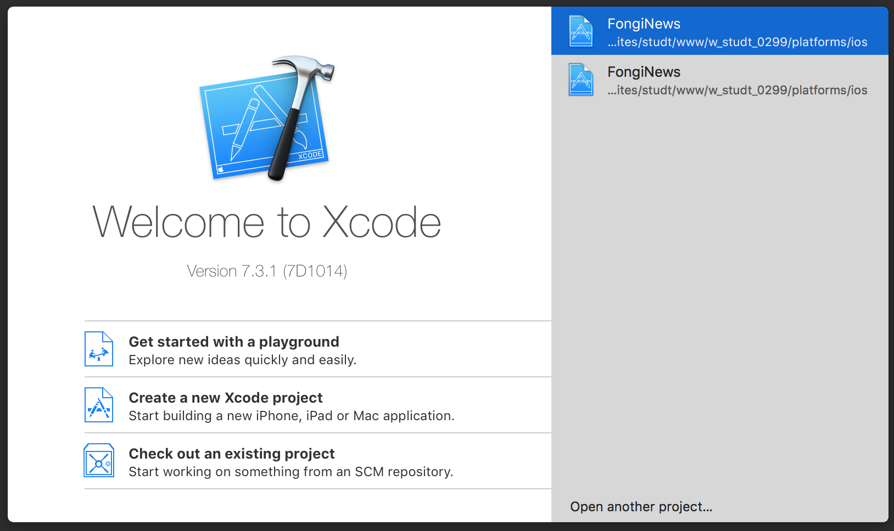
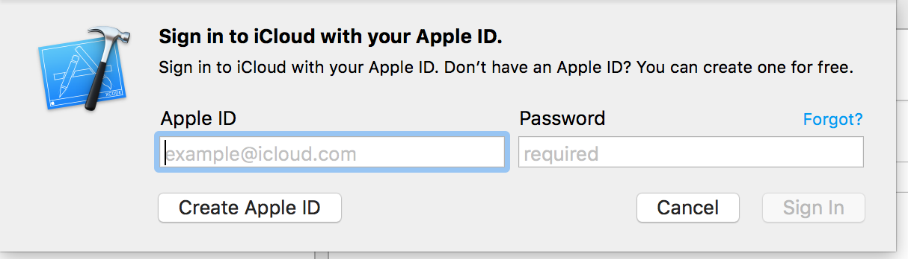
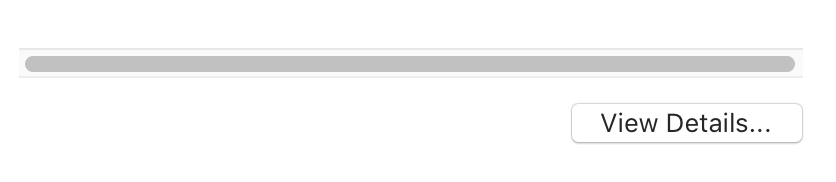
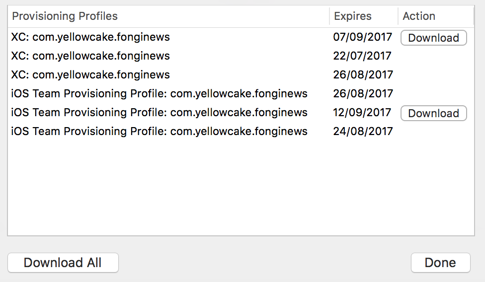
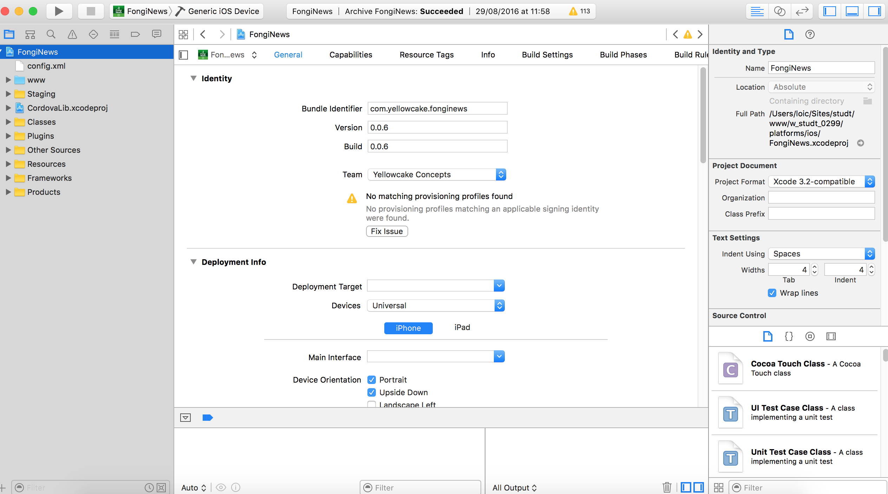
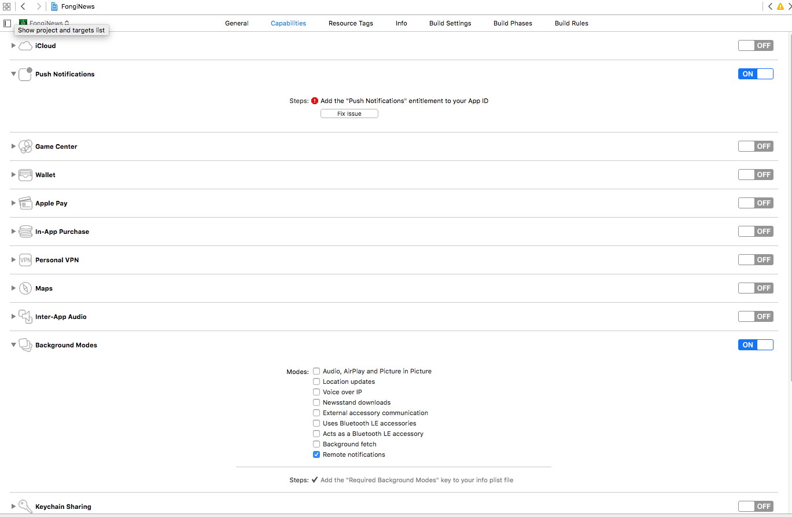
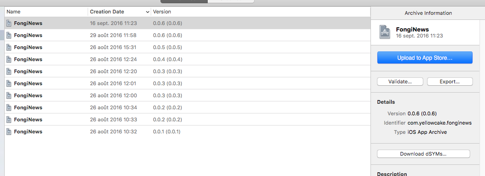

# TUTO NOTIFICATION

Lancer xcode et choisir `Open another project`

Choisir le chemin du projet.  

Aller dans le menu `Xcode / preferences / Accounts` et ajouter le compte Apple

Puis aller sur `view details`

Le certificat créé doit se retrouver dans la liste. Cliquer sur `Download all`

Cliquer sur fonginews et renseigner les détails de l'appli. `Bundle identifier`, `Version`,`Device Portrait`,`Upside Down`

Dans `capabilities` cocher `Push` et `Background mode` > `Remote notifications`

Aller sur `Product` > `Archive`

Cliquer sur `Upload to appstore`

